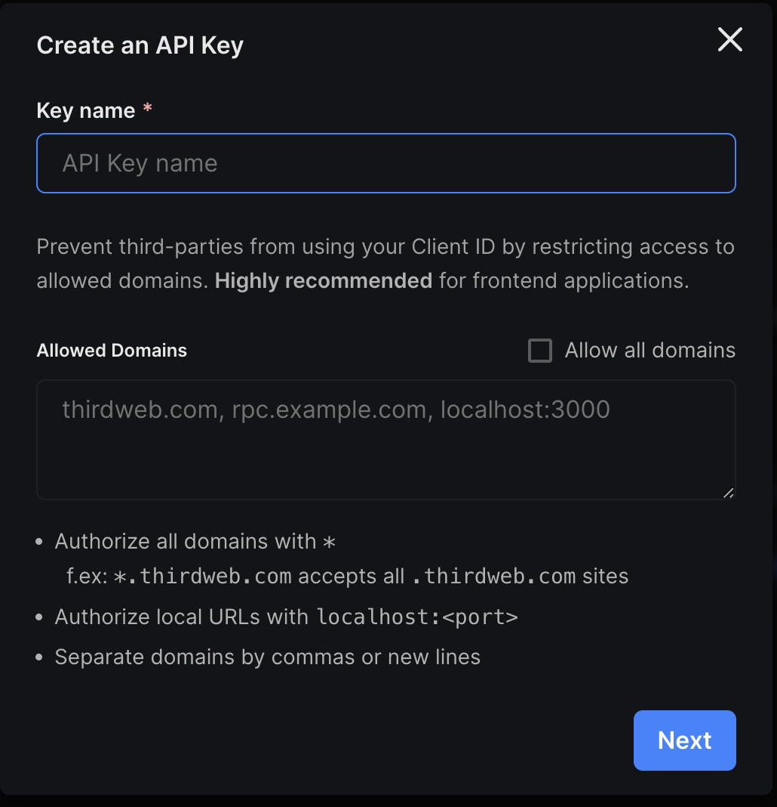
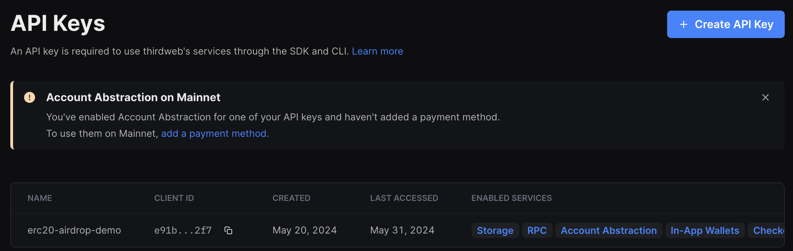
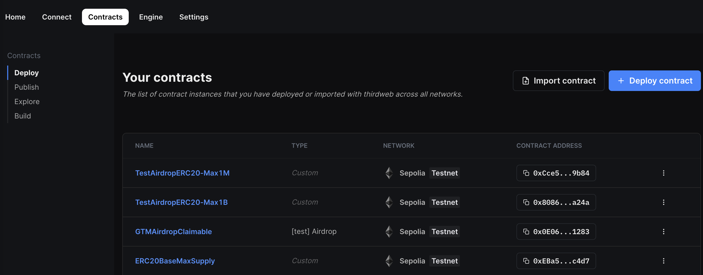

# erc20-airdrop-demo

ERC20 airdrop demos with claim based approach by reusing [thirdweb SDK + Next.js starter](https://github.com/thirdweb-example/next-starter).

## Prerequisites

1. Register a new thirdweb account by connecting your wallet on [dashboard](https://thirdweb.com/dashboard) and then [Create an API Key](https://thirdweb.com/dashboard/settings/api-keys) like this 
2. Deploy [ERC20 Max Supply contract](https://thirdweb.com/0x8AA0b6538Ba8e9DB298A7B603477e4045729b830/ERC20BaseMaxSupply): main contract to mint and airdrop token
3. Deploy [AirdropClaimable contract](https://thirdweb.com/thirdweb.eth/Airdrop) to transfer ERC20 / ERC721 / ERC1155 tokens to a list of recipient addresses, and supports push based, claim based (allowlist), and signature based airdrops
4. Wallets used for testing must have enough funds to pay the gas fee

## Setup credentials

Create the `.env` file from `.env.example` if not present

```bash
cp -R ./.env.example ./.env
```

Configure values accordingly which output from [prerequisites](#prerequisites)

* [Retrieve API Keys](https://thirdweb.com/dashboard/settings/api-keys) like this 
* [Retrieve deployed contracts](https://thirdweb.com/dashboard/contracts/deploy) like this 

```bash
NEXT_PUBLIC_TEMPLATE_CLIENT_ID=...
NEXT_PUBLIC_MAIN_AIRDROP_CONTRACT_ADDRESS=...
NEXT_PUBLIC_CLAIMABLE_AIRDROP_CONTRACT_ADDRESS=...
```

## Usage

### Install dependencies

```bash
yarn
```

### Start development server

```bash
yarn dev
```

### Create a production build

```bash
yarn build
```

### Preview the production build

```bash
yarn start
```

## Resources

* [thirdweb SDK documentation](https://portal.thirdweb.com/typescript/v5): performant & lightweight SDK to interact with any EVM chain from Node, React and React Native
* [React components and hooks](https://portal.thirdweb.com/typescript/v5/react): easily connect wallets & interact with smart contracts
* [thirdweb Dashboard](https://thirdweb.com/dashboard): manage your web3 apps
* [thirdweb CLI](https://portal.thirdweb.com/cli): tools to create, build, and deploy web3 applications
